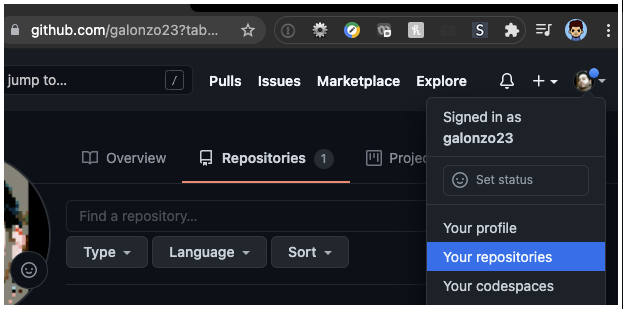

# mypersonalpage.github.io
<h1>Beginner's Guide On Creating a Personal Web Page on GitHub</h1>

The first step of becoming a web developer is to pulbish your first webpage. Here's a simple step-by-step on how to do so:

Step 1: If you haven't done so already, create an account and log in at https://www.github.com

Step 2: Once logged in, select the dropdown in the upper-right and select <b>Your repositories</b>:

Step 3: In your repositories, you'll want to click the green <b>New</b> button to start a new repository:

Step 4: 
