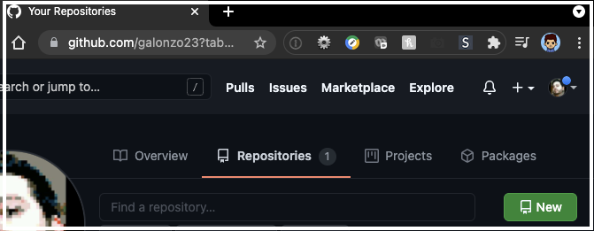
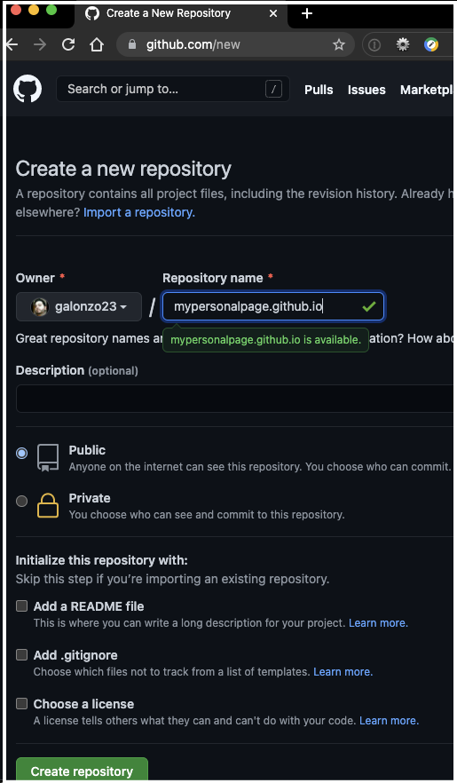

# mypersonalpage.github.io
<h1>Beginner's Guide To Creating a Personal Web Page on GitHub</h1>

The first step of becoming a web developer is to publish your first webpage. Here's a simple step-by-step tutorial on how to do so:

Step 1: First, you'll need some content for your web page, so create a folder and add an image file you would like to display on your web page, for example a profile picture (I will use mine in this example, the file name is "profilePic.jpg"). We will also add a new file, created in your favorite code editor (or a "plain text" file created in Notepad in Windows or TextEdit on MacOS), and name it "index.html", with the following basic HTML code in it that references your image file name:
```html
<html>
    <h1>My Personal Webpage</h1>
    
</html>
```
Step 2: If you haven't done so already, create an account and log in at https://www.github.com

Step 3: Once logged in, select the dropdown in the upper-right and select <b>Your repositories</b>:


Step 4: In your repositories, you'll want to click the green <b>New</b> button to start a new repository:


Step 5: Enter the address that your page will be accessed from, which will be your GitHub username at github.io; so for example, say your username was mypersonalpage, then you'll enter "mypersonalpage.github.io" and select the green <b>Create repository</b> button at the bottom:


Step 6: You'll see a Quick setup message, where you'll select the link that says Uploading an existing file:


Step 7: Now you will drag your files from step one into the github page and select the green Commit changes button at the bottom:


Step 8: Open a new browser window or tab and type in the address of your repository from step 5, and you'll see that your page is live!
