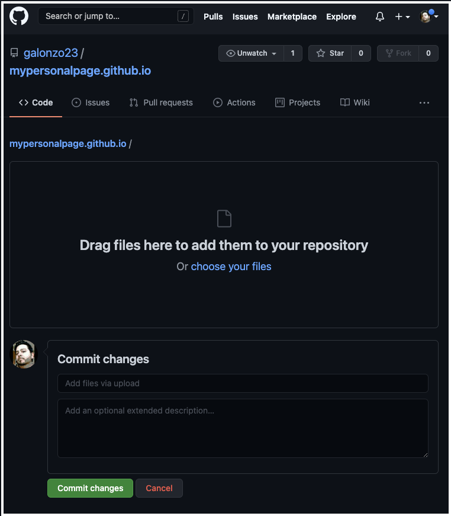

<h1>Beginner's Guide To Creating a Personal Web Page on GitHub</h1>

The first step of becoming a web developer is to publish your first webpage. Here's a simple step-by-step tutorial on how to do so:

<b>Step 1:</b><br> 
First, you'll need some content for your web page, so create a folder and add an image file you would like to display, for example a profile picture (I will use mine in this example, the file name is "profilePic.jpg"). We will also add a new file, created in your favorite code editor (or a "plain text" file created in Notepad in Windows or TextEdit on MacOS), and name it "index.html", with the following basic HTML code in it that references your image file name:
```html
<html>
    <h1>My Personal Webpage</h1>
    
</html>
```
<ul><li><b>Step 2:</b><br>If you haven't done so already, create an account and log in at https://www.github.com</li>

<li><b>Step 3:</b><br>
Once logged in, select the dropdown in the upper-right and select <b>Your repositories</b>:<br>
</li>

<li><b>Step 4:</b><br>
In your repositories, you'll want to click the green <b>New</b> button to start a new repository:<br>
</li>

<li><b>Step 5:</b><br>
Enter the address that your page will be accessed from, which will be your GitHub username at github.io; so for example, say your username was mypersonalpage, then you'll enter "mypersonalpage.github.io" and select the green <b>Create repository</b> button at the bottom:<br>
</li>

<li><b>Step 6:</b><br>
You'll see a Quick setup message, where you'll select the link that says Uploading an existing file:<br>
</li>

<li><b>Step 7:</b><br>
Now you will drag your files from step one into the github page and select the green Commit changes button at the bottom:<br>
</li>

<li><b>Step 8:</b><br>
Open a new browser window or tab and type in the address of your repository from step 5, and you'll see that your page is live!</li></ul>
